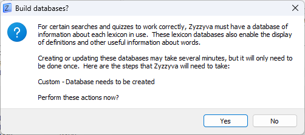

# gaming-lexicon

## Zyzzyva

[Download Zyzzyva](http://www.scrabbleplayers.org/w/NASPA_Zyzzyva_Download)

1. Load lexicon you want to use in `Preferences -> General`.

    

2. Select `Yes` if prompted to build database.

    

3. Done! Be sure to select Custom lexicon (open a new tab if missing).

    
